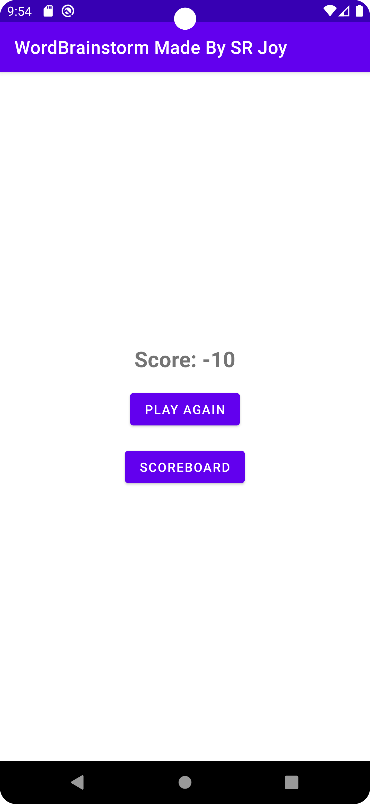

# 📝 WordGame

**WordGame** is an engaging and fun Android application where users create words from randomly picked letters. Challenge your vocabulary skills and compete with friends in this simple yet addictive game.

---

## 🎯 Vision

WordGame is designed to offer an interactive and educational experience for users of all ages. It aims to enhance your language skills while providing endless entertainment.

---

## 📋 Key Features

### 🔤 **Random Letter Generation**
- The app generates a random set of letters for players to form meaningful words.

### 🕹️ **Engaging Gameplay**
- Test your vocabulary by creating as many words as possible from the given letters.
- Compete against time to maximize your score.

### 🖼️ **Visual Delight**
- A sleek and user-friendly interface ensures a smooth gaming experience.
- Screenshot previews included below to showcase the app's design.

---

## 🌟 Screenshots

| Screenshot | Description |
|------------|-------------|
|  | The game screen displaying the welcome interface. |
|  | Gameplay screen with random letter generation. |
|  | View words you've successfully created. |
|  | End-of-game screen showing scores and performance. |

---

## 🛠️ Technology Stack

### **Frontend**
- Java for a smooth and efficient Android application.

### **Backend**
- Room Database for managing game data and player progress.

### **Additional Tools**
- Android Studio for development.
- Material Design for an intuitive and visually appealing interface.

---

## 🚀 Getting Started

### **Clone the Repository**

```bash
git clone https://github.com/your-username/WordGame
```

### **Open in Android Studio**
1. Open Android Studio.
2. Navigate to the cloned repository.
3. Build the project to sync dependencies.

### **Run on Emulator or Device**
- Connect your Android device or use an emulator.
- Run the app directly from Android Studio.

---

## 💡 Future Plans

- **Multiplayer Mode**: Compete with friends in real-time.
- **Leaderboard**: Track high scores globally and locally.
- **Word Hints**: Add hints to guide players during gameplay.
- **Custom Themes**: Allow players to personalize the app's look and feel.

---

## 🤝 Developer

- **SR Joy**
- 📧 **Contact**: [salimreza6835@gmail.com](mailto:salimreza6835@gmail.com)

---

## 🎨 Feedback

We value your feedback! If you encounter any issues or have suggestions for new features, please reach out or create an issue in the repository.

> _"Unlock the power of words and challenge your mind."_  
